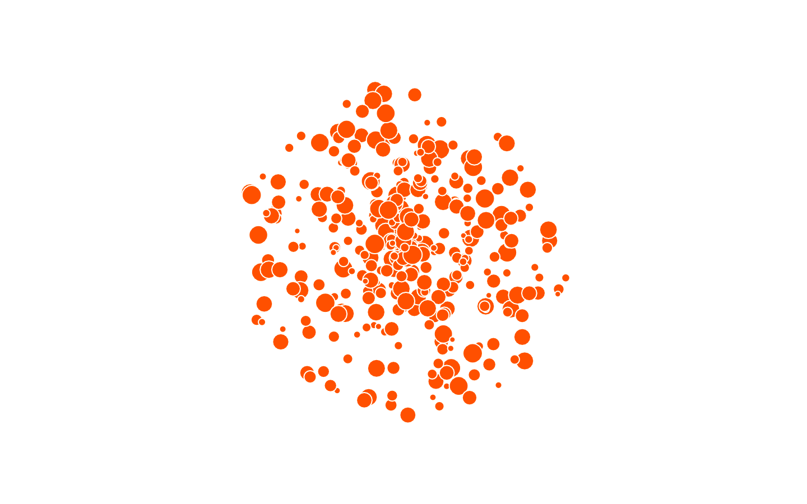

# 元気玉

[https://lennyql.github.io/energyball/]

- 製作者：
- 制作期間：２日くらい(第八耐で制作)
- 使用言語：JavaScript
- 使用ライブラリ：p5.js(Processing の js ライブラリ)
- 動作環境：Web ブラウザ(確認済み：Google Chrome)、マイク必須
  - safara での動作確認もできた(2020/6/10)
  - ライブラリを常に更新することが大事(戒め)

## 概要

- 声を出して元気を集めろ！そして弾けろ！

## 操作方法

- 大声を出して元気玉を膨らませる
- 元気満タン状態で**空気の漏れる音(スー)**を出すと元気玉が破裂する（コツを掴むまで難しい）
- これを応用して、**「うぅ〜、すぇいや！」**と声を出して遊ぶと楽しい
- 画面の上端をクリックすると元気メーターをオンオフできる
- それ以外の画面をクリックでリセット

## イメージ

### **うぅ〜**

### **すぇいや！**

